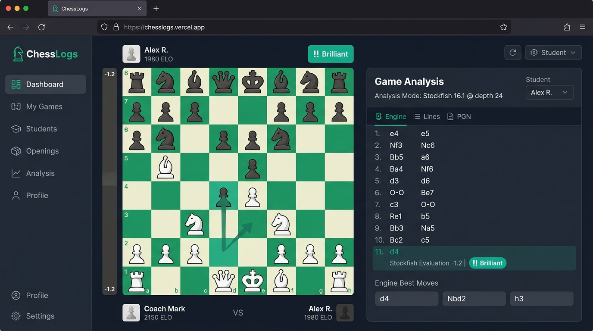

# ChessLogs

Coach–student LMS for chess improvement: assigned courses, Chess.com game sync, and Stockfish-powered game review.

[](https://chesslogs.vercel.app)

> **Live Deployment**: [https://chesslogs.vercel.app](https://chesslogs.vercel.app)

## Tech stack

- **Frontend**: React (Vite, JavaScript) + React Router + Tailwind CSS
- **Lint/format**: ESLint (`eslint:recommended` + `eslint-plugin-react` + `eslint-plugin-react-hooks`) + Prettier
- **Backend**: Supabase (Postgres + Auth + RLS). Without env vars the app runs in **demo mode** (localStorage).
- **Chess**: `chess.js`, `react-chessboard`, Stockfish 18 NNUE via Web Worker (`public/stockfish/`)
- **Hosting**: Vercel

## Important constraints

### 1. Chess.com login is not open OAuth

Chess.com’s Public API (`api.chess.com/pub/`) is unauthenticated and read-only — it does **not** prove the visitor owns a username. True “Login with Chess.com” requires Chess.com’s OAuth partner program (manual approval).

**What ChessLogs does today**

- Identity: Supabase email/password + Google OAuth
- Users **link** a Chess.com username during onboarding (trusted self-declare for MVP, with optional bio-code verification)
- Games/ratings come from the Public API — no API key needed
- Feature flag: `VITE_CHESSCOM_OAUTH_ENABLED` (default `false`). Set to `true` later if/when partner OAuth is approved. See `src/config/engine.js`.

### 2. Stockfish parity with Chess.com is approximate

Chess.com uses Stockfish 16 for fast Game Review classifications and Stockfish 18 for deep Analysis. Exact search parameters are not published.

ChessLogs uses the latest official Stockfish WASM (NNUE) with two modes in `src/config/engine.js`:

| Mode | Purpose |
|------|---------|
| `fastReview` | Lower depth/time — full-game move classifications |
| `deepAnalysis` | Higher depth/time — single-position deep dive |

Evaluations will be **close but not identical** to Chess.com due to undisclosed server-side tuning.

## Features

| Area | Notes |
|------|--------|
| Auth & roles | `admin` (coach) vs `student`; RLS in `supabase/schema.sql`; admin seeded via `scripts/seed_admin.js` |
| Profile | Display name, avatar, linked Chess.com username + Public API stats |
| Dashboard | Courses, recent reviews, rating snapshot |
| Games | Client-triggered Chess.com monthly archive sync + filters |
| Analysis | Board, eval bar, best-move arrows, Brilliant→Blunder labels, deep analysis toggle |
| Courses | Video embeds or Chessable-style walkthrough chapters; admin builder + assign |
| Admin | Student roster, course CRUD, assign, drill into student games |

## Setup

### 1. Install

```bash
npm install
cp .env.example .env
```

### 2. Supabase (production / real auth)

1. Create a Supabase project
2. Run the SQL in `supabase/schema.sql` in the SQL editor
3. Enable Email and Google providers under Authentication
4. Fill `.env`:

```bash
VITE_SUPABASE_URL=https://xxxx.supabase.co
VITE_SUPABASE_ANON_KEY=your-anon-key
SUPABASE_SERVICE_ROLE_KEY=your-service-role-key   # scripts only — never ship to the client
ADMIN_EMAIL=coach@example.com
ADMIN_PASSWORD=...
ADMIN_NAME="Your Name"
```

5. Seed the coach account:

```bash
node scripts/seed_admin.js
```

Public signup always creates **students**. Demo mode (no Supabase env) lets you switch coach/student from the UI for local exploration.

### 3. Run locally

```bash
npm run dev
```

### 4. Quality gates

```bash
npm run lint
npm run build
```

## Deploy (GitHub + Vercel)

```bash
gh auth login
vercel login

git add .
git commit -m "Initial commit: ChessLogs MVP"
# If the GitHub repo already exists, push instead of create:
git push -u origin main

vercel link --yes
vercel env add VITE_SUPABASE_URL production
vercel env add VITE_SUPABASE_ANON_KEY production
vercel --prod
```

Connect the GitHub repo to the Vercel project so pushes to `main` auto-deploy.

## Project layout

```
src/
  pages/           # Dashboard, Games, Analysis, Courses, Admin, Profile, Auth
  components/      # Board, eval bar, navbar, badges
  lib/             # db, chesscom Public API, Stockfish engine wrapper
  config/engine.js # fastReview / deepAnalysis / Chess.com OAuth flag
supabase/schema.sql
scripts/seed_admin.js
public/stockfish/  # WASM worker assets
```

## License

Private / unlicensed unless otherwise stated.
